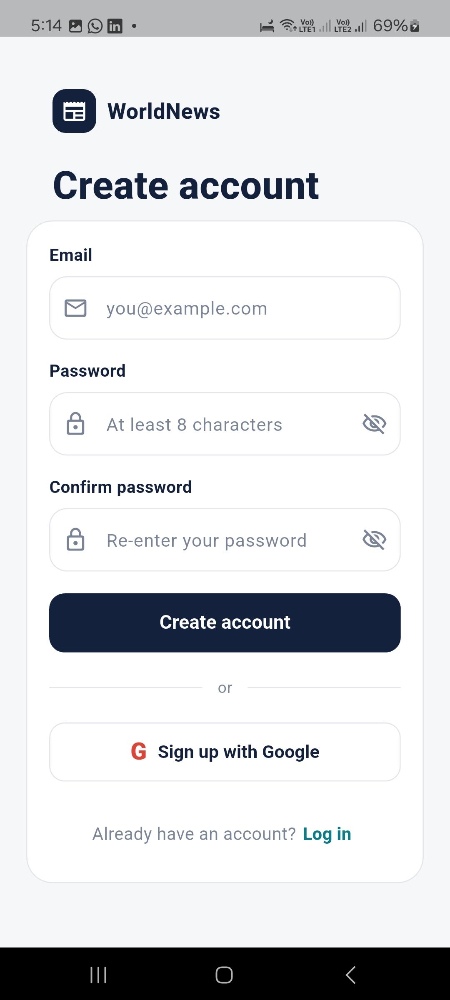
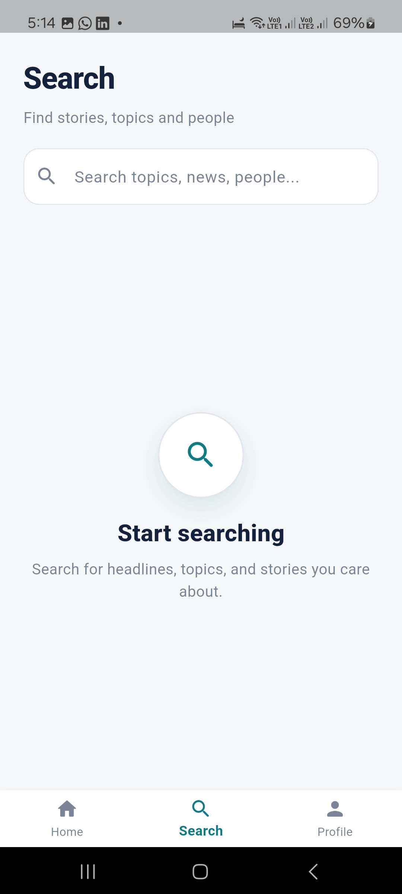

# WorldNews

A Flutter-based news application designed to showcase a modern mobile UI, authentication flow, and clean architecture for news browsing.

## Project Overview

This project was built as a full mobile app prototype for a news platform. The implementation includes:

- Login and authentication flow using Firebase Auth
- Home screen for browsing news content
- Search screen for article discovery
- Profile screen
- Modern dark-themed UI
- App icon and splash screen configuration for Android and iOS compatibility
- Flutter project structure with reusable architecture patterns

## Design Process

The app design was first created in Figma as a visual concept and then translated into a Flutter implementation to match the intended product look and feel.

Figma Design:

[View Figma Design](https://www.figma.com/design/wcMQKSdd9GypdrsPpOkhoJ/Untitled?node-id=111-401&t=onTabyuWvMIyUoZ4-0)

## App Delivery

APK Build:

[Download APK](https://drive.google.com/file/d/1iJIj8wtRGuZ_syYWZnzIxOqn9TNoNc5E/view?usp=drivesdk)

## Tech Stack

- Flutter
- Dart
- Firebase Authentication
- Firebase Core
- Bloc State Management
- Material 3 UI

## Features Implemented

- User login flow
- App navigation with bottom navigation bar
- News feed layout
- Search interface
- Profile screen
- Custom branding elements (app icon and splash screen)

## Screenshots

### Login

### Home / Top Stories

### Search

